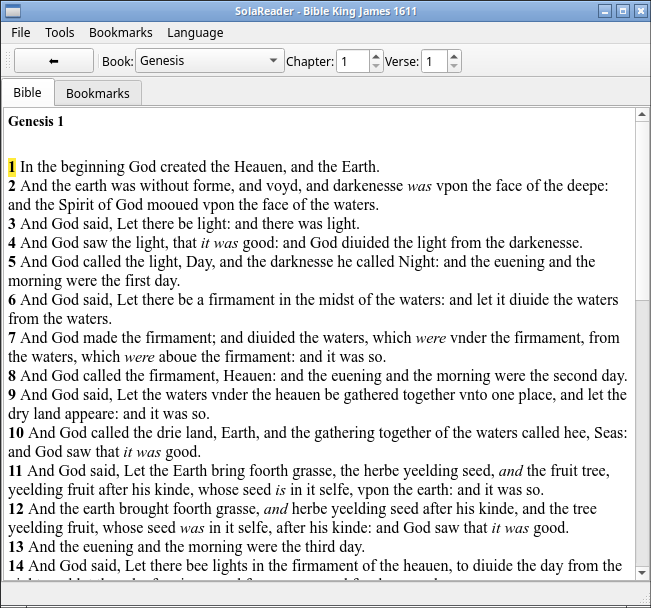

# SolaReader Bible


A program to Study the Bible working with MyBible Modules

# SolaReader - Bible Reader for Linux (in early development)


SolaReader is a modern, open-source Bible reader application for Linux systems. It's designed to work with MyBible modules in SQLite format, providing a clean and intuitive interface for reading and studying the Bible.

## Features

- **Multi-Translation Support**: Read from multiple Bible translations in SQLite format
- **Book Navigation**: Easy navigation between books, chapters, and verses
- **Search Functionality**: Search the entire Bible for specific words or phrases
- **Bookmarks**: Save and organize your favorite verses
- **Multi-Language UI**: Support for multiple interface languages
- **Cross-Platform**: Built with PyQt6 for a native look and feel

## System Requirements

- **Operating System**: Ubuntu 18.04+, Debian 10+, Linux Mint 19+
- **Python**: 3.8 or higher
- **RAM**: Minimum 512MB, Recommended 1GB+
- **Disk Space**: 50MB for application + space for Bible modules

## Install Dependencies:

   ```bash
   sudo apt update && sudo apt upgrade
   sudo apt install python3 python3-pyqt6 qttools5-dev-tools sqlite3
   ```

## 🚀 How to use the program   

### **1st OPTION: Download the repository**
Go to:

[https://github.com/wachin/SolaReader.Bible](https://github.com/wachin/SolaReader.Bible)

click on the arrow-like dropdown in Code:

**<>  Code ▼**

and click on:

**Download ZIP**

decompress it, and there inside the folder is the `solareader.bible.py` file. Open a terminal there

### **2nd OPTION: Clone the repository**

1. **Clone the Repository**:
   ```bash
   git clone https://github.com/wachin/SolaReader.Bible
   cd SolaReader.Bible
   ```

## **Run the Application**

   ```bash
   python3 solareader.bible.py
   ```
   


## Getting Started

### First Launch

1. **Navigate the Bible**:

   - By default the program open the King James Version of the Bible 
   - Use the toolbar to select books, chapters, and verses
   - Click on verse numbers to navigate directly
   - Use bookmarks to save your place

### Adding Bible Translations

1. **Download MyBible Modules**:
   - Visit to download Bible modules on english:

[https://www.ph4.org/b4_1.php?l=en](https://www.ph4.org/b4_1.php?l=en)

  - Visit to download Bible modules on spanish:

[https://www.ph4.org/b4_1.php?l=es](https://www.ph4.org/b4_1.php?l=es)
   

   - The download is `.SQLite3` files (e.g., `KJV+.SQLite3`)

2. **Install Modules**:
   - Put your modules in folder:

    data/

   - **From within the application to open others Bibles**:
     - Use `File > Open Translation` to browse and select your Bible file

## Usage Guide

### Basic Navigation

- **Book Selection**: Use the dropdown menu in the toolbar to select a book
- **Chapter Navigation**: Use the spinbox to select a chapter
- **Verse Navigation**: Use the spinbox to select a verse
- **Quick Navigation**: Click on any verse number to jump directly to that verse

### Searching the Bible

1. Click on `Tools > Search Bible` or press `Ctrl+F`
2. Enter your search term
3. Click "OK" to see search results
4. Click on any result to navigate to that verse

### Using Bookmarks

1. **Add Bookmark**:
   - Navigate to the verse you want to bookmark
   - Click `Bookmarks > Add Bookmark`
   - Enter a name for your bookmark
   - Click "OK"

2. **Manage Bookmarks**:
   - Switch to the "Bookmarks" tab
   - Click on any bookmark to navigate to that verse
   - Use `Bookmarks > Clear All Bookmarks` to remove all bookmarks

### Changing Interface Language

1. Click on `Language` in the menu bar
2. Select your preferred language from the list
3. The interface will update immediately (some changes may require restart)

## Configuration

### Configuration File

SolaReader stores its configuration in `~/.config/solareader/config.json`. You can manually edit this file to:

- Change the default Bible translation
- Adjust window size and position
- Set interface language
- Modify other preferences


### Getting Help

- **Issues**: Report bugs or request features on [GitHub Issues](https://github.com/wachin/SolaReader.Bible/issues)

## Contributing

We welcome contributions! Here's how you can help:

1. **Reporting Bugs**: Use GitHub Issues with detailed descriptions
2. **Suggesting Features**: Share your ideas on GitHub Discussions
3. **Code Contributions**: Fork the repository and submit pull requests
4. **Translation**: Help translate SolaReader into your language
5. **Documentation**: Improve our documentation and wiki

### Development Setup

1. Fork the repository
2. Install development dependencies:
3. Make your changes and submit a pull request

## License

SolaReader is released under the GNU General Public License v3.0. See the [LICENSE](LICENSE) file for details.

## Acknowledgments

- **MyBible Project**: For the excellent Bible module format
- **PyQt6 Team**: For the powerful GUI framework
- **Contributors**: All the volunteers who help improve SolaReader
- **Translators**: Those who make SolaReader accessible in multiple languages

## Changelog

### Version 1.0.0 (2025)
- Initial release
- Support for MyBible SQLite modules
- Basic navigation and search functionality
- Bookmark system
- Multi-language interface support

---

**SolaReader** - Bringing the Word of God to your Linux desktop.


